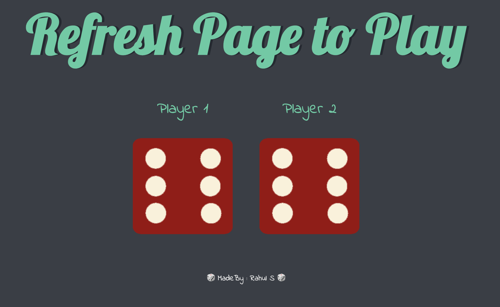
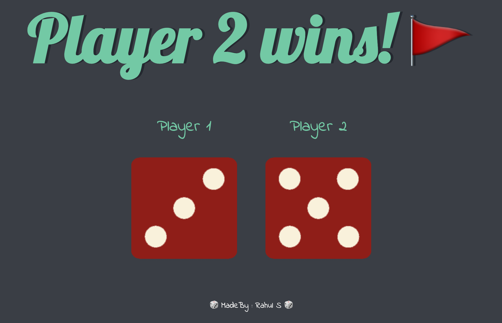

# 🎲 Dice Game

&nbsp;&nbsp;&nbsp;&nbsp; It is a simple two player dice game. Once the user refreshes the page, the dice will be randomly generated so that player 1 and player 2 both have their own dice values. The dice game will consequently announce a winner depending on whose dice value was higher. 

&nbsp;&nbsp;&nbsp;&nbsp; This project was implemented with help of the **Document Object Model** (DOM) which is a platform that allows programs/scripts to dynamically access and update the content, structure, and style of a document. This allows the website to be interactive and NOT static.

## Deployment

Play the simple game here --> Demo: [DiceGame Website](https://rahuls1428.github.io/Dice-Game/)

## Built With

  * HTML
  * CSS
  * JavaScript

## Authors

  * **Rahul Solaiappan**

## Acknowledgments

  * The Complete 2022 Web Development Bootcamp by Angela Yu
